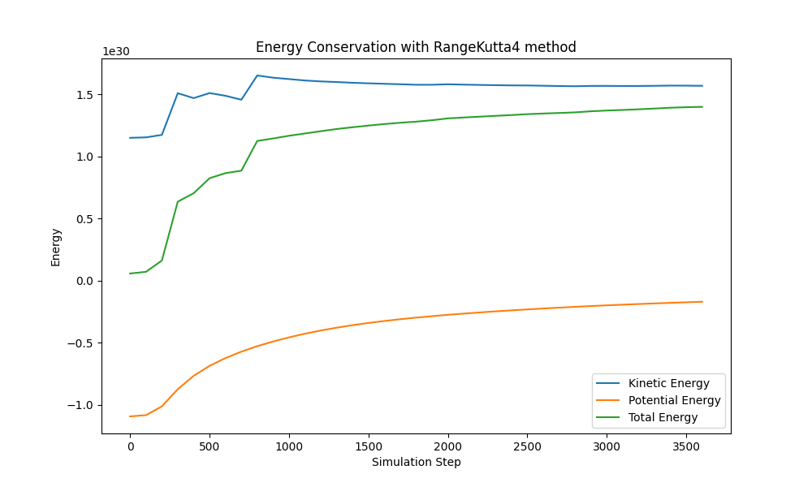
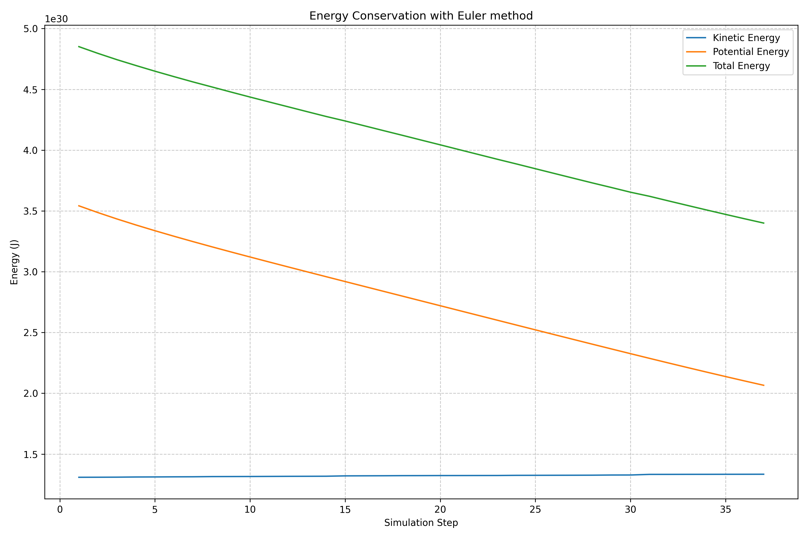

# N-Body Simulation with SYCL oneAPI

<div align="center">
<a href="https://isocpp.org/"></a>
<br>

<a href="https://github.com/yourusername/nbody-simulation/graphs/commit-activity"></a>
<a href="https://opensource.org/licenses/MIT"></a>
</div>

## 📋 Overview

This project implements an N-body simulation using C++ and SYCL oneAPI for parallel computation. It visualizes the gravitational interactions between multiple bodies in space, providing insights into celestial mechanics and complex system dynamics.

## 🎥 Demo


https://github.com/user-attachments/assets/862afd89-cb10-4e6a-9297-cb816f2e3949


## 🚀 Features

- Real-time simulation of gravitational N-Body interactions
- Parallel computation using SYCL oneAPI for optimal performance
- Visualization using SDL3 and SDL3_image
- Multiple integration methods: Euler and Runge-Kutta 4
- Energy conservation analysis

## 🛠️ Technologies

- C++
- SYCL oneAPI
- SDL3 and SDL3_image
- CMake and Make for build automation

## 📊 Results

We evaluated the simulation's accuracy by plotting the kinetic and potential energy of the system over time. Here are the results using both Euler and Runge-Kutta 4 methods:

### Runge-Kutta 4 Method


### Euler Method


## 📋 Prerequisites

- Intel oneAPI DPC++/C++ Compiler (icpx)
- SYCL-compatible runtime
- Make build automation tool
- CMake build automation tool

## 🛠️ Setting Up the Environment

### 1. Intel oneAPI DPC++/C++ Compiler

To set up the Intel oneAPI DPC++/C++ Compiler:

1. Visit the [Intel oneAPI Base Toolkit download page](https://www.intel.com/content/www/us/en/developer/tools/oneapi/base-toolkit-download.html)
2. Download and install the toolkit for your operating system
3. Set up the environment variables by running:
   ```
   source /opt/intel/oneapi/setvars.sh
   ```
   (Note: The exact path may vary depending on your installation location)

## 🚀 Building and Running the Project

1. Clone the repository:
   ```
   git clone https://github.com/yourusername/n-body-sycl.git
   cd n-body-sycl
   ```

2. Ensure you have set up the Intel oneAPI environment:
   ```
   source /opt/intel/oneapi/setvars.sh
   ```

3. Build the project:
   ```
   cmake .
   make -j YourNumberOfCore
   ```

4. Run the simulation:
   ```
   ./n-body-sycl
   ```

## 🔍 TODO

- Optimize computation using workgroups in SYCL
- Explore additional methods to validate simulation accuracy
- Investigate and resolve the lack of spiral galaxy formation
- Implement adaptive time stepping for improved accuracy
